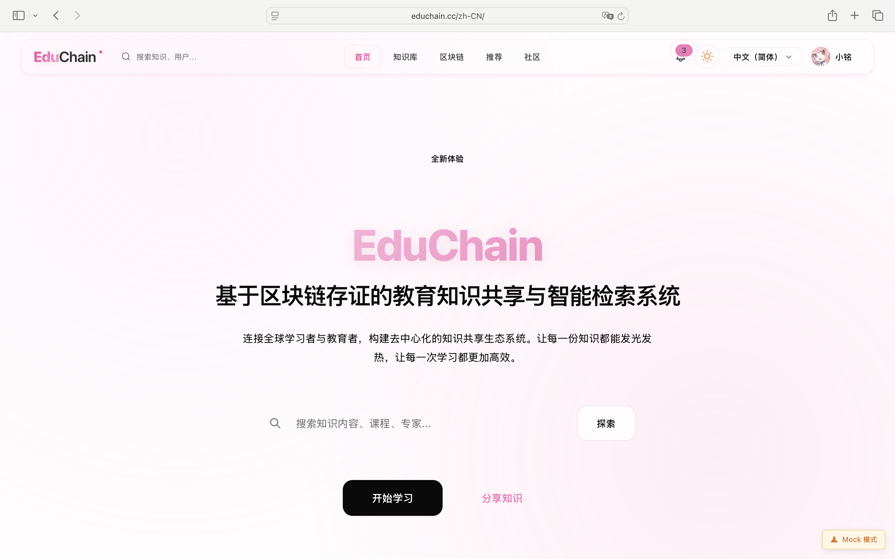
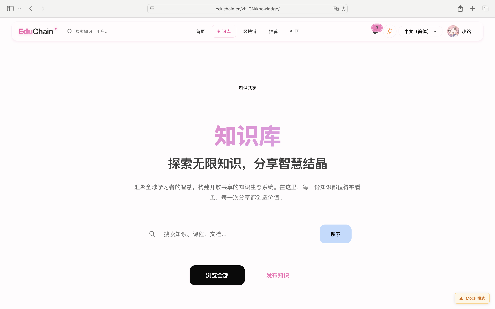
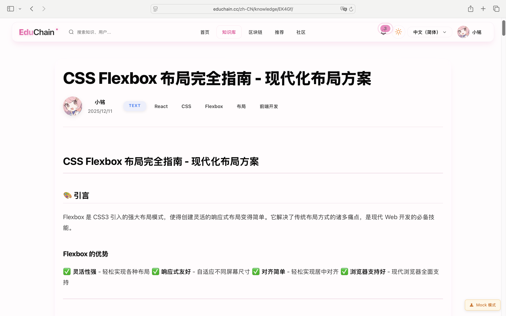
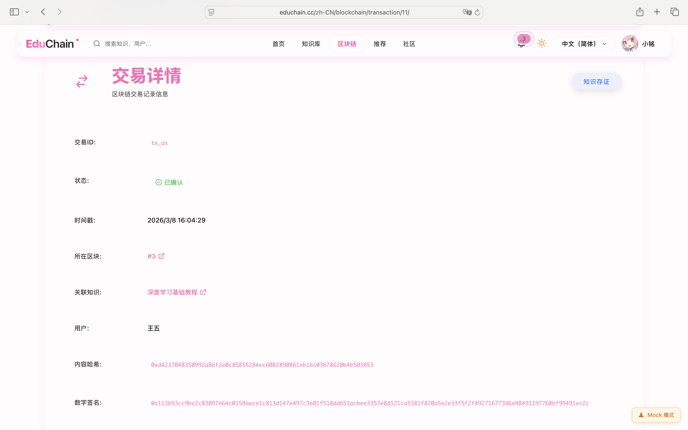
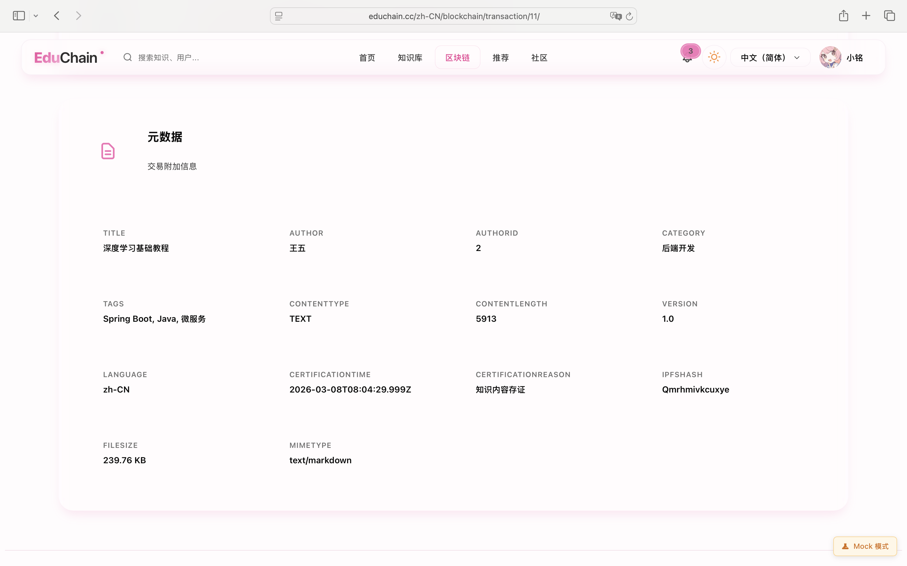

<p align="center">
  <a href="https://educhain.cc"></a>
  
  
  
  
  
  <br/>
  
  
  
  
  
  
</p>

<h1 align="center">🎓 EduChain</h1>
<h3 align="center">基于区块链存证的教育知识共享与智能检索系统 | Educational Blockchain Platform</h3>

<p align="center">
  <b>🌐 在线演示：<a href="https://educhain.cc" target="_blank">https://educhain.cc</a></b>
</p>

<p align="center">
  <b>关键词：</b> educhain | 教育区块链 | 知识分享平台 | 在线学习 | 区块链存证 | 教育科技 | 知识管理系统 | 智能检索系统 | 教育创新 | 知识产权保护
</p>

---

**EduChain** 是**基于区块链存证的教育知识共享与智能检索系统**，结合**区块链技术**实现知识内容的防篡改存证，为用户提供安全、可信的知识分享环境。通过 educhain.cc 平台，教育工作者和学习者可以安全地分享、管理和验证教育内容，打造去中心化的教育生态系统。

> 🎯 **使命**: 利用区块链技术革新教育知识分享，保护原创内容，激励优质贡献
> 
> 🔗 **GitHub**: [EduChain Repository](https://github.com/zzmingoo/educhain)

---

## 📸 系统预览

<p align="center">
  
  <br/>
  <em>EduChain 系统首页 - 现代化的知识分享平台</em>
</p>

<details>
<summary><b>🖼️ 查看更多截图</b></summary>

<table>
  <tr>
    <td width="50%">
      
      <p align="center"><em>知识列表 - 浏览和筛选</em></p>
    </td>
    <td width="50%">
      
      <p align="center"><em>知识详情 - 内容展示</em></p>
    </td>
  </tr>
  <tr>
    <td width="50%">
      
      <p align="center"><em>区块链验证 - 内容存证</em></p>
    </td>
    <td width="50%">
      
      <p align="center"><em>存证证书 - PDF证书</em></p>
    </td>
  </tr>
</table>

<p align="center">
  <a href="./docs/项目介绍.md#8-系统截图汇总">📷 查看完整截图汇总 →</a>
</p>

</details>

---

## ✨ 核心特性

- 🔐 **区块链存证** - 知识内容上链存证，确保原创性和不可篡改
- 📚 **知识管理** - 支持文本、图片、视频、文档等多种内容类型
- 🔍 **智能搜索** - 全文搜索、热词推荐、个性化推荐
- 👥 **社交互动** - 点赞、收藏、评论、关注等社交功能
- 🏆 **成就系统** - 激励用户持续贡献优质内容
- 📊 **数据统计** - 完善的数据分析和可视化

## 📖 文档导航

### 📋 项目文档

| 文档 | 说明 |
|------|------|
| [项目介绍](./docs/项目介绍.md) | 项目背景、目标、功能概述 |
| [系统架构](./docs/系统架构.md) | 整体架构设计、技术选型 |
| [快速开始](./docs/快速开始.md) | 环境搭建、项目运行指南 |
| [部署指南](./docs/部署指南.md) | 生产环境部署、Docker部署 |
| [API文档](./docs/API文档.md) | RESTful API 接口说明 |
| [贡献指南](./CONTRIBUTING.md) | 如何参与项目贡献 |

### 🗂️ 模块文档

| 模块 | 文档 |
|------|------|
| 后端服务 | [后端文档](./services/backend/src/main/java/com/example/educhain/docs/README.md) |
| 前端应用 (主要) | [前端文档](./apps/web/docs/README.md) |
| 前端应用 (旧版) | [前端文档 Legacy](./apps/web-legacy/docs/README.md) |
| 区块链服务 | [区块链文档](./services/blockchain/docs/README.md) |
| 数据库设计 | [数据库文档](./db/数据库设计文档.md) |

## 🏗️ 技术架构

```
┌─────────────────────────────────────────────────────────────┐
│                      前端 (React 19)                        │
│              TypeScript + Ant Design + Vite                 │
└─────────────────────────────────────────────────────────────┘
                              │
                              ▼
┌─────────────────────────────────────────────────────────────┐
│                   后端 (Spring Boot 3.2)                    │
│         Java 21 + Spring Security + JPA + Redis             │
└─────────────────────────────────────────────────────────────┘
          │                                      │
          ▼                                      ▼
┌─────────────────┐                   ┌─────────────────────┐
│     MySQL 8.0   │                   │  区块链服务 (Python) │
│    + Redis 7.0  │                   │      FastAPI        │
└─────────────────┘                   └─────────────────────┘
```

## 🛠️ 技术栈

### 后端
- **框架**: Spring Boot 3.2, Spring Security, Spring Data JPA
- **语言**: Java 21
- **数据库**: MySQL 8.0, Redis 7.0
- **认证**: JWT (jjwt 0.11.5)
- **文档**: SpringDoc OpenAPI 2.5.0

### 前端 (主要版本)
- **框架**: Next.js 16, React 19
- **语言**: TypeScript 5.9
- **样式**: Tailwind CSS 4
- **国际化**: Intlayer
- **Mock**: MSW (Mock Service Worker)
- **部署**: Cloudflare Pages (静态导出)

### 前端 (旧版本)
- **框架**: React 19, React Router 7
- **语言**: TypeScript
- **UI库**: Ant Design 6.0
- **构建**: Vite 6.3
- **HTTP**: Axios

### 区块链
- **框架**: FastAPI
- **语言**: Python 3.9+
- **算法**: SHA-256, Merkle Tree

## 🚀 快速开始

### 环境要求

- JDK 21+
- Node.js 18+
- Python 3.9+
- MySQL 8.0+
- Redis 7.0+

### 克隆项目

```bash
git clone https://github.com/zzmingoo/educhain.git
cd educhain
```

### 启动后端

```bash
# 配置数据库
mysql -u root -p < db/database_schema.sql

# 进入后端目录
cd services/backend

# 启动服务
mvn spring-boot:run -Dspring-boot.run.profiles=dev
```

### 启动前端

```bash
# 进入前端目录
cd apps/web

# 安装依赖
npm install

# Mock 模式开发（推荐）
npm run dev:mock

# 或连接真实后端
npm run dev
```

### 启动区块链服务

```bash
# 进入区块链服务目录
cd services/blockchain

# 安装依赖
pip install -r requirements.txt

# 启动服务
python main.py
```

### 访问地址

| 服务 | 地址 |
|------|------|
| 前端应用 (主要) | http://localhost:3000 |
| 前端应用 (旧版) | http://localhost:5173 |
| 后端API | http://localhost:8080/api |
| API文档 | http://localhost:8080/api/swagger-ui.html |
| 区块链服务 | http://localhost:8000 |

## 📁 项目结构

```
educhain/
├── apps/                         # 应用目录
│   ├── web/                      # 前端应用 (Next.js 16 + React 19 + Intlayer) ⭐ 主要版本
│   │   ├── src/                  # 源代码
│   │   │   ├── app/              # Next.js App Router
│   │   │   ├── components/       # React 组件
│   │   │   ├── services/         # API 服务层
│   │   │   └── mocks/            # MSW Mock 数据
│   │   ├── docs/                 # 前端文档 (8篇)
│   │   └── package.json
│   └── web-legacy/               # 前端应用 (React 19 + Vite) - 旧版本，仅供参考
│       ├── src/                  # 源代码
│       ├── docs/                 # 前端文档 (7篇)
│       └── package.json
├── services/                     # 服务目录
│   ├── backend/                  # 后端服务 (Spring Boot 3.2 + Java 21)
│   │   ├── src/main/java/com/example/educhain/
│   │   │   ├── controller/       # 控制器 (21个)
│   │   │   ├── service/          # 服务层 (22个)
│   │   │   ├── entity/           # 实体类 (21个)
│   │   │   ├── repository/       # 数据访问层
│   │   │   ├── config/           # 配置类
│   │   │   └── dto/              # 数据传输对象
│   │   ├── docs/                 # 后端文档 (11篇)
│   │   └── pom.xml               # Maven 配置
│   └── blockchain/               # 区块链服务 (Python 3.9+ + FastAPI)
│       ├── app/
│       │   ├── blockchain.py     # 区块链核心
│       │   ├── api.py            # API接口
│       │   └── certificate.py    # 证书生成
│       ├── docs/                 # 区块链文档 (11篇)
│       └── requirements.txt
├── db/                           # 数据库脚本
│   ├── database_schema.sql       # 建表脚本
│   └── 数据库设计文档.md
└── docs/                         # 项目文档
    ├── 项目介绍.md
    ├── 系统架构.md
    ├── 快速开始.md
    ├── 部署指南.md
    └── API文档.md
```

## 📊 功能模块

| 模块 | 功能 |
|------|------|
| 用户系统 | 注册、登录、个人中心、关注 |
| 知识管理 | 发布、编辑、版本管理、草稿 |
| 分类标签 | 分类树、标签管理、热门标签 |
| 社交互动 | 点赞、收藏、评论、分享 |
| 搜索推荐 | 全文搜索、热词、个性化推荐 |
| 区块链 | 内容存证、证书生成、验证 |
| 通知系统 | 消息通知、系统公告 |
| 管理后台 | 用户管理、内容审核、统计 |

## 🤝 贡献

欢迎提交 Issue 和 Pull Request！

详见 [贡献指南](./CONTRIBUTING.md)

## 📄 许可证

本项目采用 [MIT License](./LICENSE) 开源许可证。

## 👨‍💻 作者

- **小铭** - [GitHub](https://github.com/zzmingoo) - zzmingoo@gmail.com

## 🙏 致谢

感谢所有为本项目做出贡献的开发者！

---

<p align="center">
  ⭐ 如果这个项目对你有帮助，请给一个 Star！
</p>
