# EduChain 项目介绍

  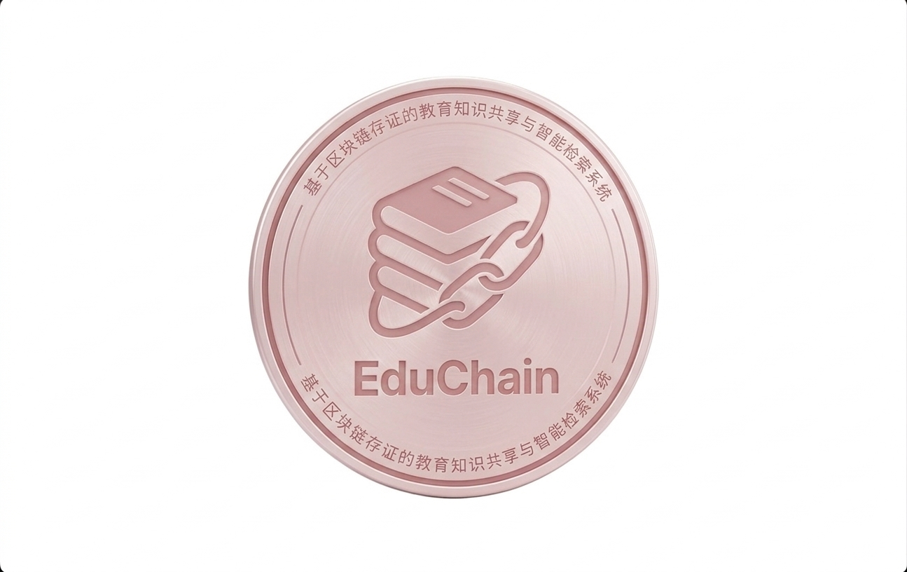

  <b>基于区块链存证的教育知识共享与智能检索系统</b>

---

## 项目名称

**基于区块链存证的教育知识共享与智能检索系统设计与实现**

## 1. 项目背景

### 1.1 研究背景

随着互联网技术的快速发展，在线教育和知识共享平台已成为人们获取知识的重要途径。然而，现有平台普遍存在以下问题：

- **版权保护不足**: 原创内容容易被抄袭，创作者权益难以保障
- **内容可信度低**: 缺乏有效的内容溯源和验证机制
- **激励机制缺失**: 优质内容创作者难以获得应有的认可和回报

### 1.2 解决方案

EduChain 创新性地将区块链技术引入教育知识共享领域，通过去中心化的存证机制，为知识内容提供不可篡改的时间戳证明，有效解决了上述问题。

### 1.3 系统预览

  
   
  <em>图1: EduChain 系统首页</em>

## 2. 项目目标

### 2.1 核心目标

- 构建安全可信的知识共享平台
- 实现知识内容的区块链存证
- 提供优质的用户体验和社交功能
- 建立有效的内容激励机制

### 2.2 技术目标

- 采用现代化技术栈，确保系统性能和可扩展性
- 实现前后端分离架构，提高开发效率
- 构建完善的安全防护体系
- 提供完整的API文档和开发文档

## 3. 功能概述

### 3.1 核心功能展示

<table>
  <tr>
    <td width="50%">
      
      
<em>知识列表页 - 浏览和筛选知识内容</em>

    </td>
    <td width="50%">
      
      
<em>知识详情页 - 查看内容和互动</em>

    </td>
  </tr>
  <tr>
    <td width="50%">
      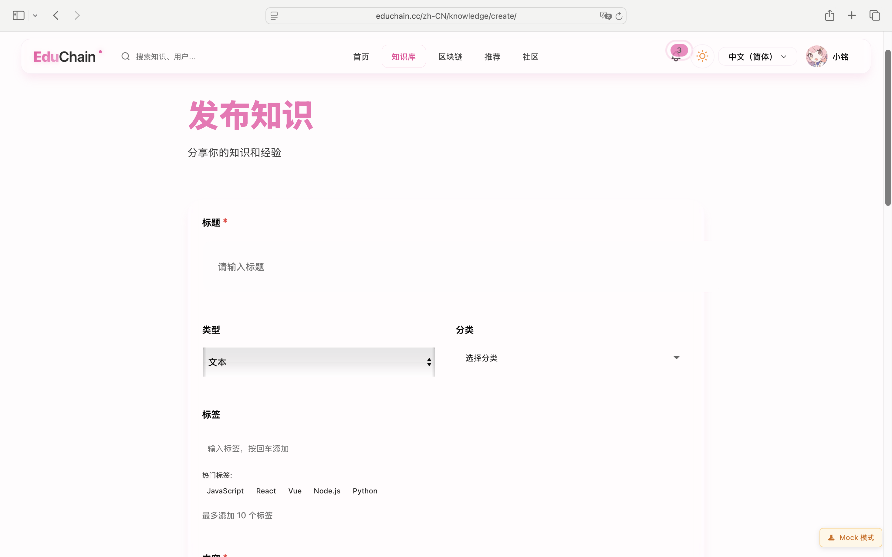
      
<em>创建知识页 - 富文本编辑器</em>

    </td>
    <td width="50%">
      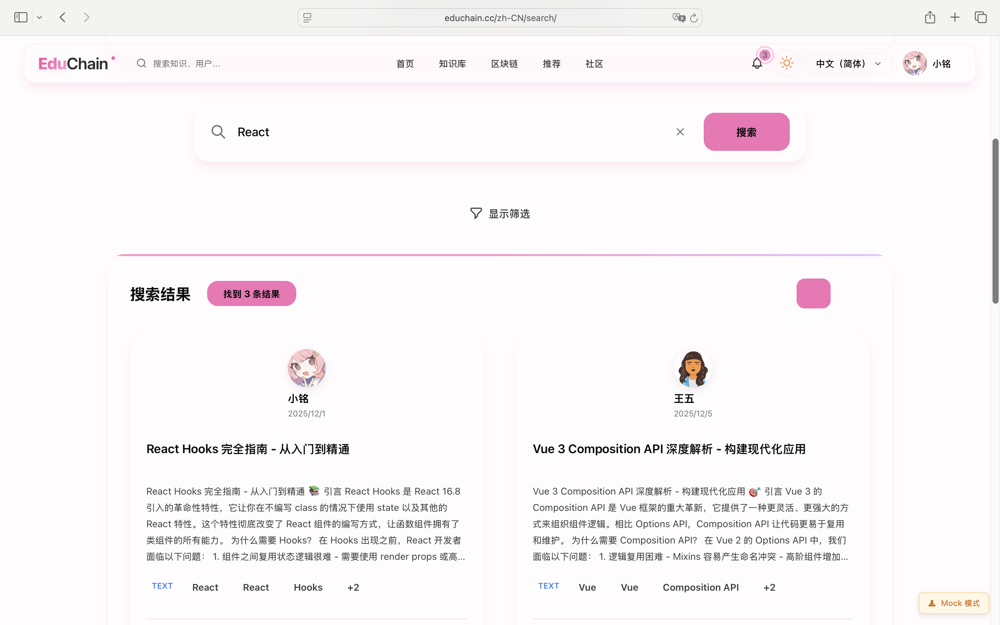
      
<em>搜索页面 - 智能检索和筛选</em>

    </td>
  </tr>
</table>

### 3.1 用户系统

| 功能 | 说明 |
|------|------|
| 用户注册 | 支持用户名、邮箱注册 |
| 用户登录 | JWT令牌认证，支持记住登录 |
| 个人中心 | 个人信息管理、头像上传 |
| 用户关注 | 关注/粉丝系统 |
| 成就系统 | 用户等级、成就徽章 |

### 3.2 知识管理

| 功能 | 说明 |
|------|------|
| 内容发布 | 支持文本、图片、视频、文档、链接 |
| 内容编辑 | 富文本编辑器，支持Markdown |
| 版本管理 | 历史版本查看、版本对比、版本恢复 |
| 草稿功能 | 自动保存草稿，草稿管理 |
| 分类标签 | 多级分类、自定义标签 |

### 3.3 社交互动

| 功能 | 说明 |
|------|------|
| 点赞 | 对知识内容点赞 |
| 收藏 | 收藏感兴趣的内容 |
| 评论 | 发表评论、回复评论 |
| 分享 | 生成分享链接、分享码 |

<b>📸 社交功能截图展示</b>

<table>
  <tr>
    <td width="50%">
      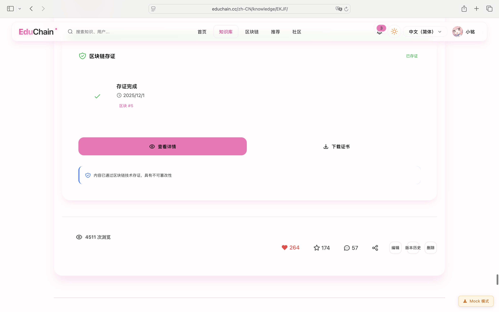
      
<em>点赞和收藏功能</em>

    </td>
    <td width="50%">
      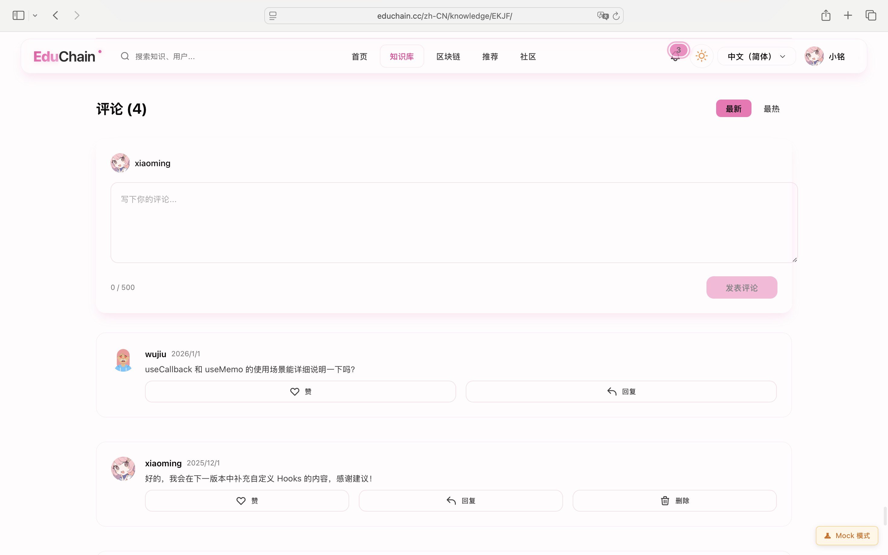
      
<em>评论和回复功能</em>

    </td>
  </tr>
  <tr>
    <td width="50%">
      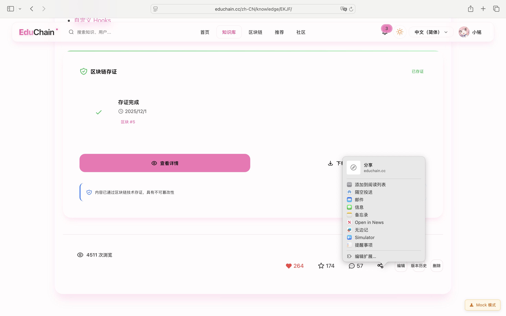
      
<em>分享功能</em>

    </td>
    <td width="50%">
      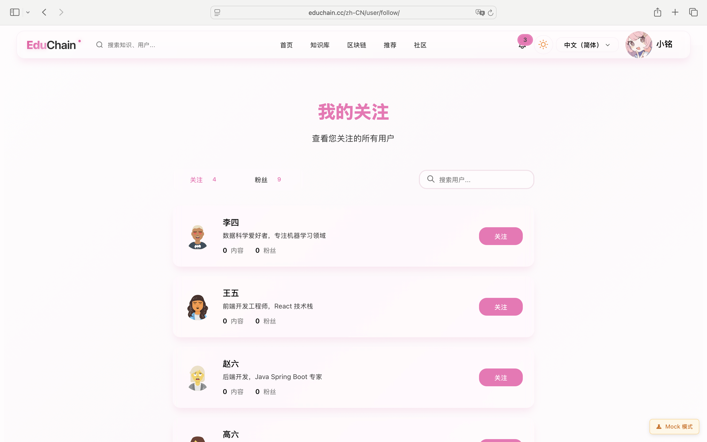
      
<em>用户关注功能</em>

    </td>
  </tr>
</table>

### 3.4 搜索推荐

| 功能 | 说明 |
|------|------|
| 全文搜索 | 基于关键词的内容搜索 |
| 高级搜索 | 多条件组合筛选 |
| 热门推荐 | 基于热度的内容推荐 |
| 个性化推荐 | 基于用户行为的推荐 |
| 搜索建议 | 输入联想、热词推荐 |

### 3.5 区块链存证

| 功能 | 说明 |
|------|------|
| 内容存证 | 知识内容自动上链存证 |
| 存证查询 | 查询存证记录和区块信息 |
| 证书生成 | 生成PDF存证证书 |
| 内容验证 | 验证内容是否被篡改 |

#### 🔐 区块链功能展示

<table>
  <tr>
    <td width="50%">
      
      
<em>区块链验证页面 - 验证内容完整性</em>

    </td>
    <td width="50%">
      
      
<em>存证证书 - PDF证书和二维码</em>

    </td>
  </tr>
</table>

> 💡 **核心亮点**: 每个知识内容发布后自动上链存证，生成唯一的区块链证书，确保内容不可篡改，保护原创者权益。

### 3.6 管理后台

| 功能 | 说明 |
|------|------|
| 用户管理 | 用户列表、禁用/启用、密码重置 |
| 内容审核 | 待审核内容、审核通过/拒绝 |
| 评论管理 | 评论审核、删除违规评论 |
| 数据统计 | 用户统计、内容统计、访问统计 |
| 系统配置 | 系统参数配置 |

<b>📊 管理后台截图展示</b>

<table>
  <tr>
    <td width="33%">
      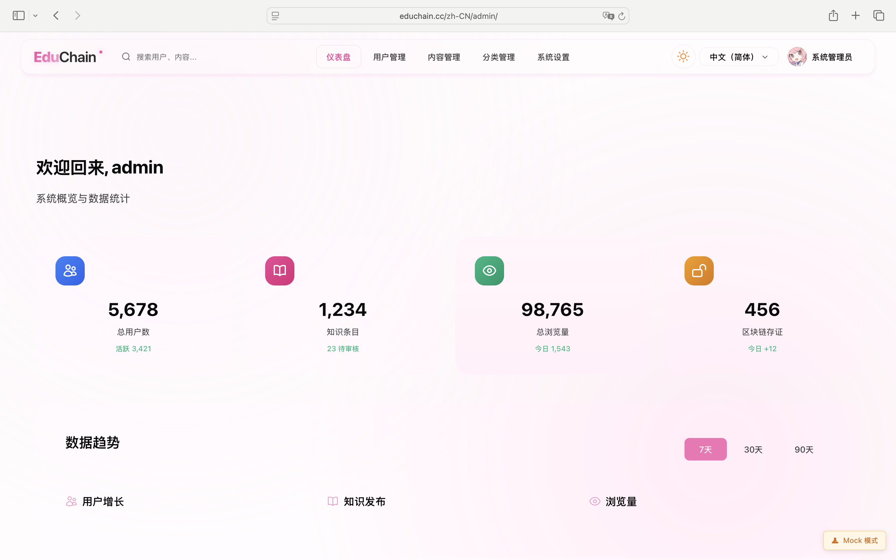
      
<em>管理后台首页</em>

    </td>
    <td width="33%">
      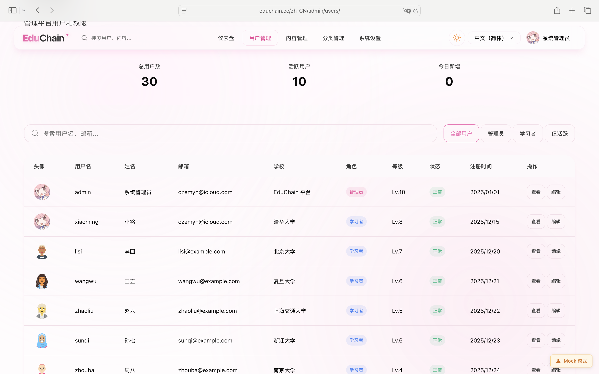
      
<em>用户管理</em>

    </td>
    <td width="33%">
      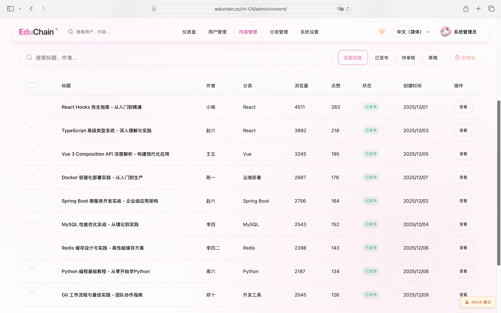
      
<em>内容审核</em>

    </td>
  </tr>
</table>

## 4. 系统特点

### 4.0 用户体验展示

  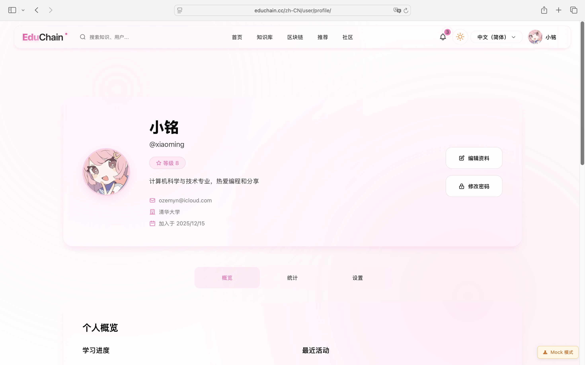
   
  <em>图2: 用户个人中心 - 个人信息、统计数据、成就系统</em>

### 4.1 技术先进性

- **最新技术栈**: Spring Boot 3.2 + Java 21 + React 19
- **区块链技术**: 自研轻量级区块链，SHA-256哈希算法
- **安全可靠**: JWT认证、RBAC权限、限流保护

### 4.2 用户体验

- **响应式设计**: 适配PC和移动端
- **流畅交互**: 单页应用，无刷新体验
- **美观界面**: Ant Design组件库

### 4.3 可扩展性

- **模块化设计**: 功能模块独立，易于扩展
- **微服务架构**: 区块链服务独立部署
- **API标准化**: RESTful API，OpenAPI文档

## 5. 应用场景

### 5.1 教育领域

- 学习笔记分享
- 课程资料共享
- 学术论文存证

### 5.2 企业培训

- 内部知识库
- 培训资料管理
- 经验分享平台

### 5.3 个人知识管理

- 个人笔记整理
- 知识收藏管理
- 学习成果展示

## 6. 项目价值

### 6.1 学术价值

- 探索区块链在教育领域的应用
- 研究知识产权保护的技术方案
- 实践现代化软件工程方法

### 6.2 实用价值

- 提供可落地的知识共享解决方案
- 保护知识创作者的合法权益
- 促进优质教育资源的传播

## 7. 未来展望

- 支持更多内容类型（音频、3D模型等）
- 引入AI辅助内容审核和推荐
- 支持多链存证（以太坊、IPFS等）
- 开发移动端APP
- 建立知识交易市场

---

## 8. 系统截图汇总

### 8.1 前台用户界面

| 页面 | 说明 | 截图 |
|------|------|------|
| 首页 | 系统首页，展示推荐内容 | [查看](./images/screenshots/home-page.png) |
| 知识列表 | 浏览和筛选知识内容 | [查看](./images/screenshots/knowledge-list.png) |
| 知识详情 | 查看内容详情和互动 | [查看](./images/screenshots/knowledge-detail.png) |
| 创建知识 | 发布新的知识内容 | [查看](./images/screenshots/knowledge-create.png) |
| 搜索页面 | 智能搜索和筛选 | [查看](./images/screenshots/search-page.png) |
| 用户中心 | 个人信息和统计 | [查看](./images/screenshots/user-profile.png) |

### 8.2 区块链功能

| 功能 | 说明 | 截图 |
|------|------|------|
| 区块链验证 | 验证内容完整性 | [查看](./images/screenshots/blockchain-verify.png) |
| 存证证书 | PDF证书和二维码 | [查看](./images/screenshots/certificate-view.png) |

### 8.3 管理后台

| 页面 | 说明 | 截图 |
|------|------|------|
| 管理首页 | 数据统计和图表 | [查看](./images/screenshots/admin-dashboard.png) |
| 用户管理 | 用户列表和操作 | [查看](./images/screenshots/admin-users.png) |
| 内容审核 | 待审核内容管理 | [查看](./images/screenshots/admin-content.png) |

### 8.4 社交功能

| 功能 | 说明 | 截图 |
|------|------|------|
| 点赞收藏 | 互动功能 | [查看](./images/features/feature-like.png) |
| 评论回复 | 评论系统 | [查看](./images/features/feature-comment.png) |
| 分享功能 | 内容分享 | [查看](./images/features/feature-share.png) |
| 用户关注 | 关注系统 | [查看](./images/features/feature-follow.png) |

---

## 9. 在线演示

🌐 **在线体验**: [https://educhain.cc](https://educhain.cc)

📺 **演示视频**: [待添加]

📖 **完整文档**: [查看文档目录](./)
